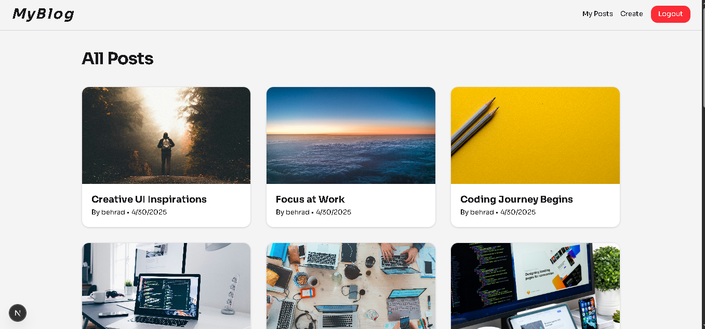
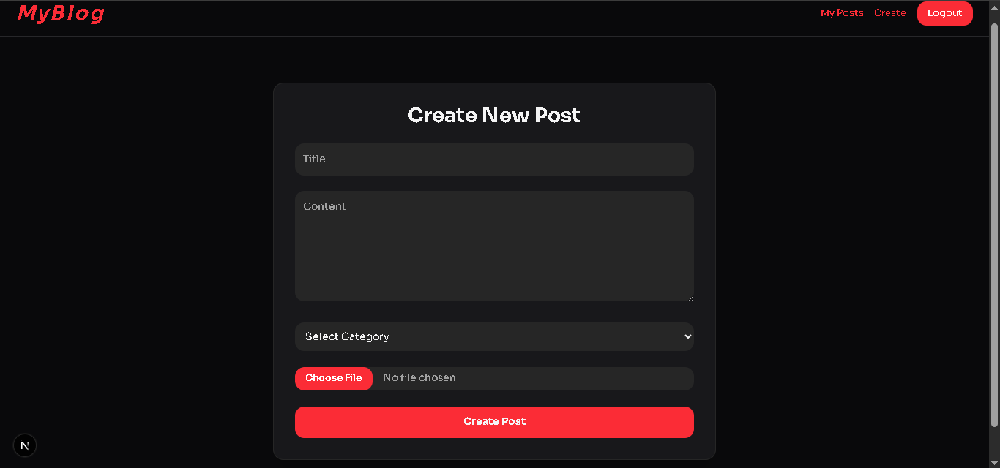
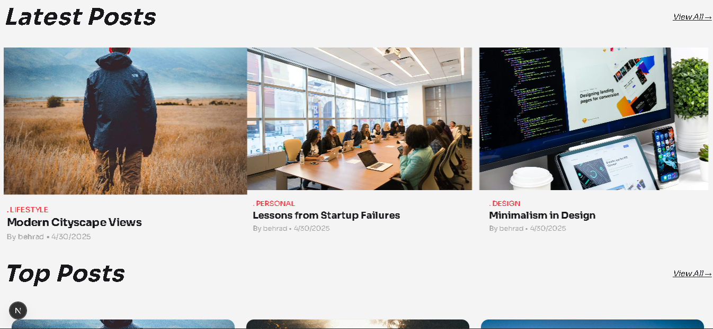

# 📝 Fullstack Blog App

A modern fullstack blog platform built with **Next.js**, **Prisma**, **PostgreSQL**, and **Zustand**, allowing users to create, view, update, delete, like/dislike, and comment on blog posts in real time.

🔐 Authentication with JWT & protected routes
✍️ Create / Update / Delete blog posts (with image upload)
📂 Categories (using enum in Prisma)
📸 Image uploading via Cloudinary
❤️ Like / Dislike toggle system with optimistic UI
💬 Commenting system
🧠 Top Posts section based on likes
⚡ Fully responsive design (Mobile, Tablet, Desktop)

---

🛠️ Tech Stack
Frontend:
-Next.js  (App Router)
-TypeScript
-React Query
-Zustand (Global State)
-Tailwind CSS
-Axios
-Toast Notifications (react-hot-toast)

Backend:
-Node.js & Express
-TypeScript
-Prisma ORM
-PostgreSQL (via Neon)
-Cloudinary (Image Hosting)
-JWT (Authentication)
-RESTful API

---

## 📸 Screenshots
  
  




---

## 🚀 Getting Started

### 1️⃣ Clone the Repository

git clone https://github.com/Behrad-BeigZadeh/ecommerce-fullstack.git
cd ecommerce-fullstack

### 🧰 Backend

1. Go to the `backend/` folder
2. Install dependencies:
   ```bash
   npm install
   
 ### Set up environment variables
-PORT=5000
-DATABASE_URL=You can add it from neon
-ACCESS_TOKEN_SECRET=your_access_token
-REFRESH_TOKEN_SECRET=your_refresh_token
-ARCJET_KEY=your_arcjet_key
-ARCJET_ENV=development | production
-CLOUDINARY_CLOUD_NAME=your_cloudinary_name
-CLOUDINARY_API_KEY=your_cloudinary_key
-CLOUDINARY_API_SECRET=your_cloudinary_secret

npm run dev

### Seeding Database 
-npx prisma migrate dev --name init

-npm run seed


---

 ### 🧰 Frontend

1. Go to the `frontend/` folder
2. Install dependencies:
   ```bash
   npm install

 ### Set up environment variables
-NEXT_PUBLIC_API_BASE=http://localhost:5000

npm run dev


